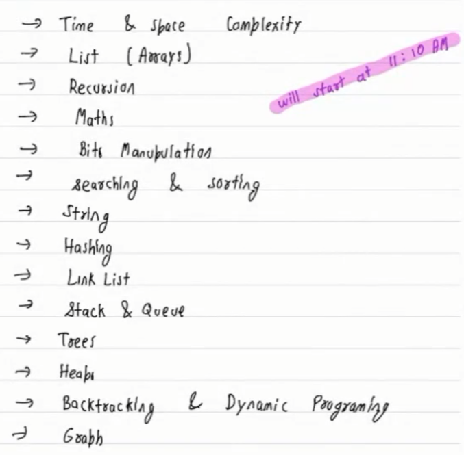

# Advance-DSA-Python

Topic covered
1. Time and space complexity
7. List(array)
8. Recursion
2. Maths
9. Bits Manupulation
5. Searching and sorting
5. string
5. Hashing
5. Link list
2. Stack & Queue
4. Trees
1. Heaps
1. Backtracking & Dynamic Programming
1. Graph

78295555

## 1. Time and space complexity
- to compair 2 algorithm we use time and space complexity
    * `Widows vs Mac`: mac is faster
    * `C++ vs Python`: C++ is faster
    * `North India vs Mount Everest`: Cold weather is good for run faster
    * input size
- there could be varity of problem that's where the execution time can not be called right metrices to compair 2 algorithm.
- to solve this problem we come up with the soluition which is time and space complexity.
- we use order of complexity(O(n)) to compair. this metrics by consider the input.

`Q1. what is this mean log2(N)?` <br>
`Ans`: how many steps we need to take to reach to 1.
```
* N --> N/2 --> N/4 --> N/8 --> ........... --> 1
* ex: log2(8) = 8 --> 4 --> 2 --> 1 (3 step to reached to 1)
```

`Q2. how many total element inside it?` <br>
Ans:
```
* [3, 10] => b-a+1 ==> 10-3+1=8
* [a,b) => b-a
```
#### Arithematic Progression
`Q3. Sum of N-term in AP: 2,4,6,8,10`
 

#### Geometric progression
`Q4. `


# Sum of Geometric Progression

To find the sum of the geometric progression (GP) [20, 10, 5, 2.5, 1.25], we use the formula:

S_n = a(1 - r^n) / (1 - r)

Where:
- S_n is the sum of the first n terms.
- a is the first term of the series.
- r is the common ratio.
- n is the number of terms.

In this GP:
- First term, a = 20
- Common ratio, r = 10 / 20 = 0.5
- Number of terms, n = 5

Now, let's plug these values into the formula:

S_5 = 20(1 - 0.5^5) / (1 - 0.5)

S_5 = 20(1 - 0.03125) / 0.5

S_5 = 20 * 0.96875 / 0.5

S_5 = 19.375 / 0.5

S_5 = 38.75

So, the sum of the given geometric progression is 38.75.

# Time Complexity
In finding the time complexity we ignore the one which has low significant. very small number we are not bother about that.


Q7. 
Q8. 
Q9. 
Q10. 

list: 

Name of complexity
